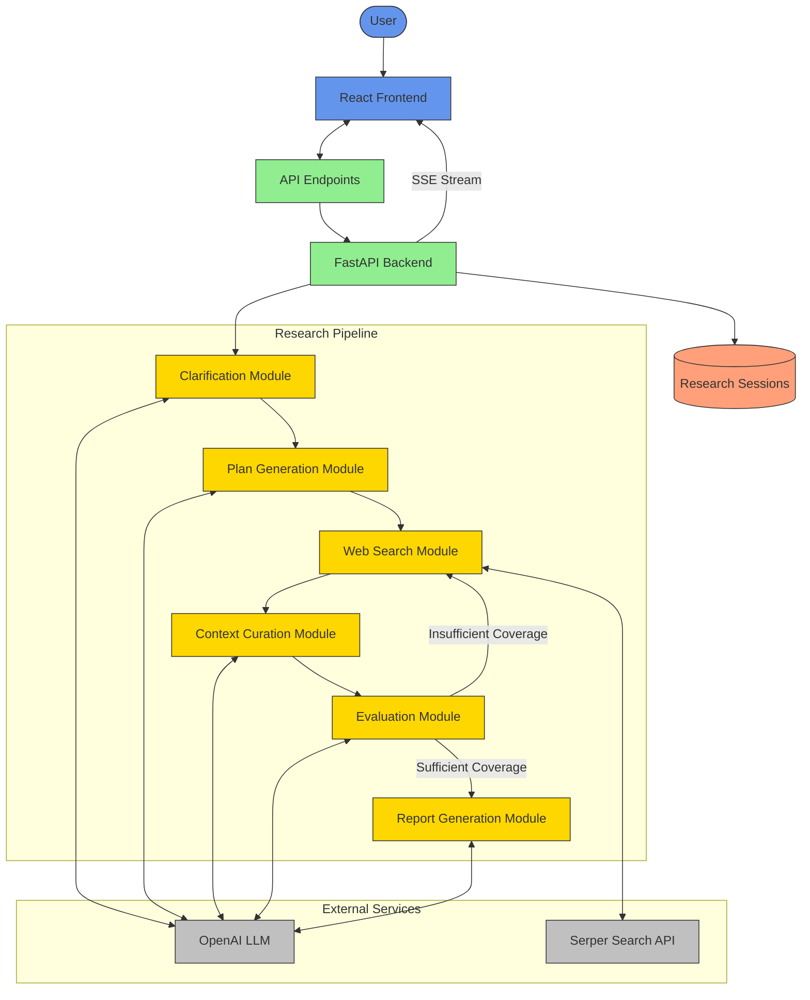

# Deep Researcher

<div align="center">
  
  
  
  
</div>

A sophisticated AI-powered research assistant that conducts thorough web research on any topic and generates comprehensive reports with proper citations.

### Backend Architecture




## Features

- **Intelligent Multi-stage Research Process**: Takes your topic through clarification, planning, searching, curation, evaluation, and report generation
- **Interactive Clarification**: Asks targeted questions to better understand your research needs
- **Real-time Progress Tracking**: Watch as the research unfolds with live updates at each stage
- **Web Search Integration**: Searches the internet for the most relevant and up-to-date information
- **Content Curation**: Organizes findings into a coherent structure
- **Quality Evaluation**: Assesses research completeness and conducts additional searches if needed
- **Comprehensive Reporting**: Generates well-structured reports with proper citations
- **Dark Mode Support**: Easy on the eyes with a beautiful dark theme

##  Technology Stack

### Backend
- **FastAPI**: Fast, modern Python web framework
- **OpenAI API**: Powers the LLM capabilities for advanced research tasks
- **Serper API**: Provides web search functionality
- **Pydantic**: For data validation and settings management
- **asyncio/aiohttp**: For asynchronous processing

### Frontend
- **React**: UI library for building the user interface
- **Tailwind CSS**: For styling and responsive design
- **Framer Motion**: For smooth animations and transitions
- **React Markdown**: For rendering the final research report

## Getting Started

### Prerequisites

1. Python 3.9+
2. Node.js 16+
3. OpenAI API key
4. Serper API key

### Installation

#### Clone the repository

```bash
git clone https://github.com/yourusername/deep-researcher.git
cd deep-researcher
```

#### Backend Setup

1. Create and activate a virtual environment:

```bash
cd backend
python -m venv venv
source venv/bin/activate  # On Windows: venv\Scripts\activate
```

2. Install dependencies:

```bash
pip install -r requirements.txt
```

3. Create a `.env` file in the backend directory:

```
OPENAI_API_KEY=your_openai_api_key_here
SERPER_API_KEY=your_serper_api_key_here
LLM_MODEL=gpt-4o
LLM_TEMPERATURE=0.2
LLM_MAX_TOKENS=4000
SERPER_API_URL=https://google.serper.dev/search
DEBUG=False
FRONTEND_URL=http://localhost:3000
```

4. Start the backend server:

```bash
uvicorn main:app --reload
```

The backend API will be available at `http://localhost:8000`.

#### Frontend Setup

1. Install dependencies:

```bash
cd frontend
npm install
```

2. Start the development server:

```bash
npm start
```

The frontend application will be available at `http://localhost:3000`.

## How to Use

1. **Enter your research topic**: Start by entering the topic you want to research.

2. **Answer clarification questions**: The system will ask a few questions to better understand your needs.

3. **Watch the research process**: The application will show you its progress as it:
   - Generates a research plan
   - Searches the web for information
   - Curates and organizes the findings
   - Evaluates the completeness of the research
   - Generates a comprehensive report

4. **Review the final report**: Once the research is complete, you'll see a well-structured report with:
   - An introduction
   - Multiple sections covering different aspects of the topic
   - A conclusion
   - Citations and references to sources

5. **Download or copy the report**: You can download the report as Markdown or copy it to your clipboard.

## Project Structure

```
deep-researcher/
├── backend/                 # FastAPI backend
│   ├── main.py              # Main application
│   ├── config.py            # Configuration settings
│   ├── models/              # Data models (Pydantic)
│   ├── modules/             # Research modules
│   │   ├── clarification.py
│   │   ├── plan_generation.py
│   │   ├── web_search.py
│   │   ├── context_curation.py
│   │   ├── evaluation.py
│   │   └── report_generation.py
│   └── services/            # External services
│       ├── llm_service.py
│       └── serper_service.py
│
└── frontend/                # React frontend
    ├── public/
    └── src/
        ├── components/      # React components
        ├── contexts/        # Context providers
        ├── services/        # API services
        └── utils/           # Utility functions
```

## API Documentation

### Backend API Endpoints

| Endpoint | Method | Description |
|----------|--------|-------------|
| `/api/research/start` | POST | Start a new research session |
| `/api/research/{session_id}/clarification` | GET | Get clarification questions |
| `/api/research/{session_id}/clarification` | POST | Submit answers to clarification questions |
| `/api/research/{session_id}/plan` | GET | Generate a research plan |
| `/api/research/{session_id}/status` | GET | Get current research status |
| `/api/research/{session_id}/report` | GET | Get the final research report |
| `/api/research/{session_id}/stream` | GET | Stream research progress updates |
| `/api/research/{session_id}/report/stream` | GET | Stream report generation progress |

## Configuration

The application can be configured through environment variables:

### Backend Configuration

| Variable | Description | Default |
|----------|-------------|---------|
| `OPENAI_API_KEY` | Your OpenAI API key | (Required) |
| `SERPER_API_KEY` | Your Serper API key | (Required) |
| `LLM_MODEL` | OpenAI model to use | `gpt-4o` |
| `LLM_TEMPERATURE` | Temperature for LLM responses | `0.2` |
| `LLM_MAX_TOKENS` | Maximum tokens for LLM responses | `4000` |
| `SERPER_API_URL` | Serper API URL | `https://google.serper.dev/search` |
| `DEBUG` | Enable debug mode | `False` |
| `FRONTEND_URL` | URL of the frontend application | `http://localhost:3000` |

## Contributing

Contributions are welcome! Here's how you can contribute:

1. Fork the repository
2. Create a new branch (`git checkout -b feature/amazing-feature`)
3. Make your changes
4. Commit your changes (`git commit -m 'Add some amazing feature'`)
5. Push to the branch (`git push origin feature/amazing-feature`)
6. Open a Pull Request

## Future Enhancements

Here are some planned enhancements for future versions:

- **User Authentication**: Save research history and allow users to return to previous research
- **Additional Search APIs**: Integrate academic databases and specialized search engines
- **Export Options**: Export reports in various formats including PDF, DOCX, etc.
- **Custom Citation Styles**: Support for different citation styles (APA, MLA, Chicago)
- **Data Visualization**: Automatically generate charts and graphs from research data
- **Research Templates**: Pre-configured templates for different types of research

## Troubleshooting

If you encounter issues:

- **Frontend Connection Issues**: Ensure the backend is running and check CORS settings
- **API Key Errors**: Verify your API keys are correctly set in the .env file
- **Web Search Errors**: The Serper API has rate limits; check your usage
- **Content Processing Errors**: Some websites block content scraping; this is normal
- **LLM Errors**: Check that your OpenAI API key has sufficient quota

## License

This project is licensed under the MIT License - see the LICENSE file for details.
